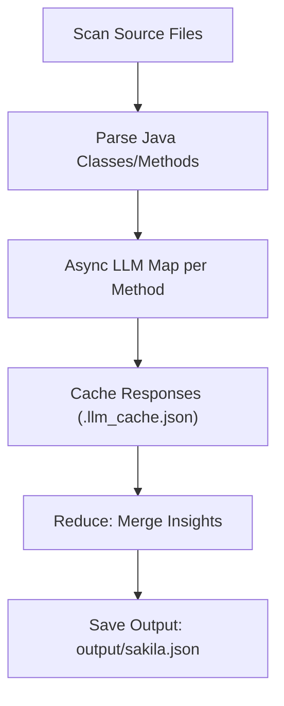

#  SakilaProject Codebase Analysis using LLM

### Objective

This project demonstrates an automated approach to analyzing a software codebase using a Large Language Model (LLM). The solution reads and parses the SakilaProject (a sample Spring Boot application), then uses an LLM to extract structured insights about the project’s architecture, classes, and methods.

##  Overview

### Goal

Build a program that:

1. Reads source files in the given codebase.
2. Efficiently feeds Java method snippets to an LLM for summarization (map), then aggregates results (reduce).
3. Generates structured knowledge in a machine-readable JSON format.

The output (`sakila.json`) captures:

- Project tech stack and dependencies
- Class and method metadata (signature, LOC, cyclomatic complexity)
- Package hierarchy and responsibilities
- Potential insights and gaps

##   Tech Stack

| Component | Purpose |
| --- | --- |
| Python 3.9+ | Driver language for orchestration |
| LangChain | LLM integration and prompt orchestration |
| OpenAI/Azure/Bedrock | Model providers via LangChain `init_chat_model` |
| tqdm | Progress tracking |
| javalang + lizard | Java parse + cyclomatic complexity |

##  Architecture

Processing Flow



##  Implementation Details

1) Source Discovery

- Scans `--repo` for these extensions: `.java`, `.kt`, `.js`, `.ts`, `.py`, `.cs` (see `SUPPORTED_EXTENSIONS`).
- Ignores common build/output dirs (e.g., `node_modules`, `target`, `build`, `.git`, `dist`, `out`, `venv`, `.venv`).

2) Java Parsing + Complexity

- Parses Java with `javalang` to enumerate classes and methods.
- Extracts method-level code snippet and computes cyclomatic complexity via `lizard`.

3) LLM Map/Reduce

- Map: per-method summarization using prompts from `prompts.py` (strict JSON output). Requests run concurrently using asyncio with `--workers` control.
- Reduce: aggregates fragments into a high-level project summary (overview, noteworthy design, cross-cutting concerns, possible gaps).

4) Caching

- On-disk JSON cache `.llm_cache.json` keyed by model + snippet content avoids re-calling the API on re-runs.

##  Example Command

```bash
# Create venv and install
python -m venv .venv
source .venv/bin/activate  # Windows PowerShell: .venv\Scripts\Activate.ps1
python -m pip install -r requirements.txt

# Set credentials (choose one provider)
export OPENAI_API_KEY=...            # or
export AZURE_OPENAI_API_KEY=...      # and AZURE_OPENAI_ENDPOINT=...

# Run
python main.py \
  --repo ../SakilaProject \
  --provider openai \
  --model gpt-4o-mini \
  --workers 6 \
  --out output/sakila.json
```

##  Output Structure

The generated JSON contains:

- `repo`: absolute path to the analyzed repository
- `generated_at`: UTC timestamp
- `tech_stack`: parsed Maven dependencies and highlighted frameworks (Spring Boot, Thymeleaf, MySQL, etc.)
- `high_level_overview`, `noteworthy_aspects`, `cross_cutting_concerns`, `possible_gaps`: aggregated project insights
- `packages`: breakdown of packages → classes → methods, including signatures, LOC, complexity, summaries, risks, and external calls

Example snippet

```json
{
  "tech_stack": {
    "build": "maven",
    "dependencies": ["spring-boot-starter-web", "mysql-connector-java"],
    "frameworks_detected": ["spring-boot", "mysql"]
  },
  "packages": {
    "com.example": [
      {
        "class": "FilmController",
        "methods": [
          {"signature": "String listFilms()", "loc": 14, "summary": "..."}
        ]
      }
    ]
  }
}
```

##  Performance Enhancements

| Technique | Impact |
| --- | --- |
| Async per-method map phase | 3–5× faster runtime vs. serial |
| JSON cache (.llm_cache.json) | Saves cost and time on re-runs |
| Strict JSON prompts | Reliable downstream parsing |

Tune concurrency with `--workers` (reduce if rate limited).

## 🧾 Deliverables

| File | Description |
| --- | --- |
| `main.py` | Core implementation (async map + reduce + caching) |
| `prompts.py` | Prompts for map/reduce steps |
| `requirements.txt` | Project dependencies |
| `output/sakila.json` | Structured project summary (example path) |
| `.llm_cache.json` | Reusable local cache for map results |


## License

This project is provided as-is for the PeerIslands technical exercise.
